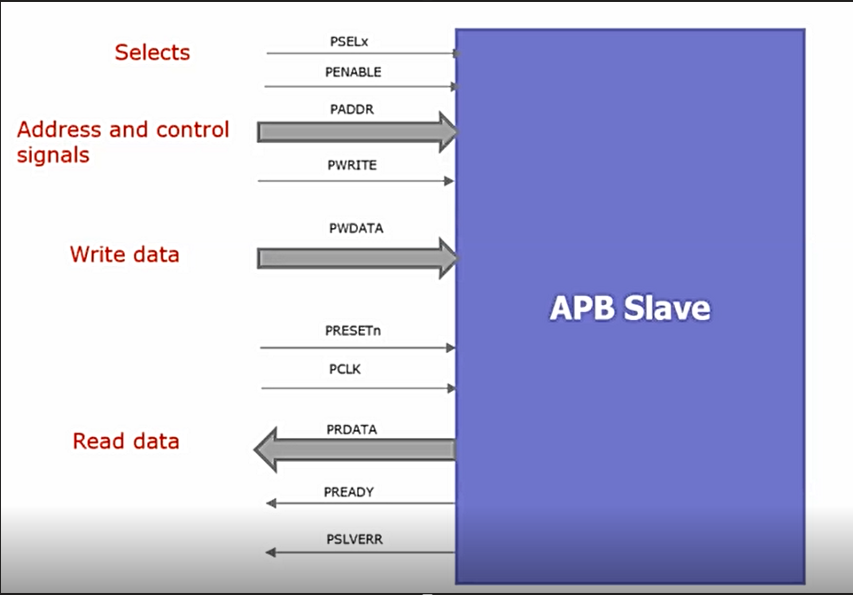
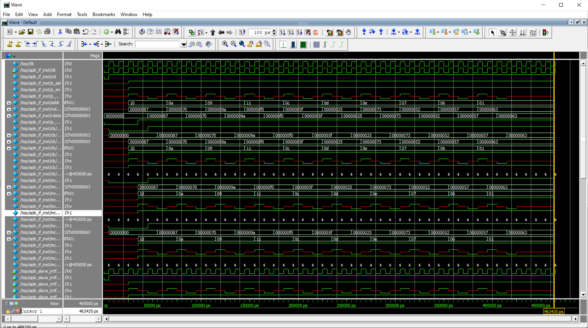

# APB SLAVE Verification Environment

Verification of APB SLAVE Model Using in SystemVerilog and UVM. 
* [APB Slave DUT](Design_APBSlave)
* [System Verification Environment](APBSLAVE_SV)
* [Universal Verification Methodology](APBSLAVE_UVM)
\
\

## Wave Signals

#
